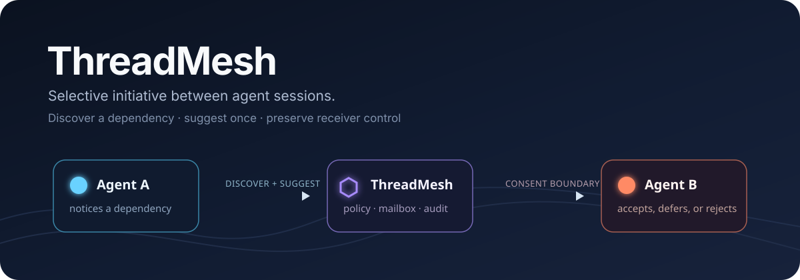

<p align="center">
  
</p>

<p align="center">
  <a href="https://github.com/fyaic/threadmesh/actions/workflows/ci.yml"></a>
  <a href="LICENSE"></a>
  <a href="package.json"></a>
  <a href="docs/10-planning/project-status.md"></a>
</p>

<p align="center">
  <a href="#quickstart"><strong>Quickstart</strong></a> ·
  <a href="docs/06-guides/real-world-cases.md">Real agent cases</a> ·
  <a href="docs/00-overview/harness-support.md">Harness support</a> ·
  <a href="docs/README.md">Documentation</a> ·
  <a href="README.zh-CN.md">简体中文</a>
</p>

# ThreadMesh

ThreadMesh is an experimental coordination protocol and JavaScript integration
kit that lets one agent session notice an authorized dependency, decide whether
to contact another session, and deliver a bounded suggestion without sharing
global chat history or taking over the receiver.

**The agent supplies the initiative. ThreadMesh supplies the boundary.**

> [!IMPORTANT]
> ThreadMesh is pre-alpha and disabled-by-default infrastructure. The current
> release is suitable for local, trusted-process experiments—not production
> authorization, hostile prompts, or multi-tenant deployment.

## Why this matters

Running several agents in parallel creates a new coordination problem. Agent A
may finish the exact input Agent B needs, but neither session knows when it is
useful to speak. The user becomes a human message bus: notice the dependency,
copy the result, find the right session, and explain why it matters.

ThreadMesh makes that handoff an explicit, portable capability:

1. the host authorizes a relationship between exact task incarnations;
2. B publishes a minimal relationship-scoped summary—not its private history;
3. A may inspect that summary and **autonomously decide** whether to act;
4. A can send one typed, expiring suggestion with provenance;
5. B's harness accepts, rejects, or defers it before model-context admission;
6. the decision and delivery chain stays auditable.

The intelligence is not “agents can send messages.” It is **selective
initiative**: speaking when a dependency is real, staying quiet when it is not,
and preserving the other session's agency.

## What proactive behavior looks like

Our real Pi evaluation gave Agent A only two bounded ThreadMesh tools and tested
three conditions:

| Condition | What Agent A chose | Receiver effect |
|---|---|---|
| Relevant dependency | discover once → suggest once | B accepted and completed |
| Unrelated task | discover once → stay silent | B was not activated |
| No related task (control) | use no ThreadMesh tool | zero interference |

The same relevant path then crossed products: **Pi `0.84.2` → ThreadMesh →
Kimi Code `0.38.0`**. Pi chose to contact B; Kimi retained its own persistent
session and admission boundary; the coordinator recorded `context-admitted`;
and every temporary resource was deleted. A separate real **Codex CLI `0.145.0`
→ Kimi Code `0.38.0`** case produced the same autonomous `discover → suggest`
sequence.

[Read the case portfolio](docs/06-guides/real-world-cases.md) ·
[Reproduce the Pi-to-Kimi path](docs/06-guides/pi-to-kimi-demo.md) ·
[Inspect the bounded evidence](docs/09-reviews/2026-08-25-pi-integration-kit-validation.md)

## Quickstart

### 1. Run the closed-loop attention-router demo

```sh
npx --yes --package=github:fyaic/threadmesh threadmesh demo
```

Or run from source:

```sh
git clone https://github.com/fyaic/threadmesh.git
cd threadmesh
npm ci
npm run demo
```

This deterministic demo creates four isolated sessions and runs an
implementation → review → fix → review → dependent-task sequence. It exposes
the event, routing reason, receiver decision, external verification,
dependency effect, and cleanup state without spending model quota or touching
your agent sessions.

[Read the attention-router demo guide](docs/06-guides/attention-router-demo.md)

Run the earlier model-selection control/relevant/irrelevant comparison next:

```sh
npm run validate:behavior:fake
```

Run the smallest cross-harness proof next:

```sh
npm run validate:cross-harness:fake
```

### 2. Add proactive tools to a harness

The package is not on npm yet. Install the pre-alpha SDK directly from GitHub:

```sh
npm install github:fyaic/threadmesh
```

Connect it to an authenticated ThreadMesh JSON-RPC transport, then create one
bridge per native model turn:

```js
import {
  createProactiveToolBridge,
  createThreadMeshClient,
} from "@fyaic/threadmesh";

const client = createThreadMeshClient({
  authorization: `Bearer ${process.env.THREADMESH_TOKEN}`,
  send: async (request, { authorization }) => {
    const response = await fetch(process.env.THREADMESH_URL, {
      method: "POST",
      headers: { authorization, "content-type": "application/json" },
      body: JSON.stringify(request),
    });
    return response.json();
  },
});

const bridge = createProactiveToolBridge({
  client,
  source: currentTask,
  relationships: [{ relationshipId, target: relatedTask }],
});

await harness.runModelTurn({
  tools: bridge.tools,
  onToolCall: bridge.handleToolCall,
});
```

The host—not the model—selects the bounded relationship set. Discovery is
required before sending; the default budget allows one lookup and one
suggestion; the receiving harness still controls context admission.

[30-minute integration guide](docs/06-guides/implement-an-adapter.md) ·
[complete sender/receiver example](examples/proactive-tool-bridge.mjs) ·
[SDK reference by example](examples/minimal-harness.mjs)

## Capabilities

| Capability | What ThreadMesh provides today |
|---|---|
| Relationship-scoped discovery | Minimal summaries for exact host-authorized task relationships |
| Bounded proactive suggestion | Two model tools with per-turn discovery and send budgets |
| Receiver sovereignty | Mailbox checkpoint with explicit accept, reject, or defer |
| Freshness and replay defense | Exact task incarnation, expiry, revision, idempotency, and claim checks |
| Provenance and audit | Sender, relationship, reason, disposition, admission, and cleanup evidence |
| Harness portability | Transport-neutral SDK plus ACP, App Server, and subprocess adapter experiments |
| Fail-closed negotiation | Unsupported `steer` or `interrupt` behavior is not silently approximated |

The draft protocol distinguishes four coordination intents:

| Intent | Default behavior | Typical use |
|---|---|---|
| `notify` | Side-channel information; not active prompt context | Progress or dependency update |
| `suggest` | Receiver mailbox; explicit checkpoint decision | Peer advice or a missing input |
| `steer` | May change active direction; requires stronger authority | Parent-to-child correction |
| `interrupt` | Requests typed cancellation; highest privilege | Safety stop or invalidated work |

Only bounded `suggest` is enabled in the real product experiments.

## Harnesses and agents

ThreadMesh coordinates **tasks**, so the model provider and harness can differ
on each side.

| Harness / integration | Role exercised | Evidence level |
|---|---|---|
| Pi `0.84.2` extension | Real proactive sender through the packaged public SDK | Real model pass |
| Codex CLI `0.145.0` App Server | Real proactive sender and receiver | Real model pass |
| Kimi Code `0.38.0` ACP | Persistent receiving session | Real model pass |
| Gemini CLI `0.56.0` headless | Subprocess receiver adapter | Deterministic + no-model preflight; live model not run |
| Custom JavaScript harness | Cooperative loop or native tool bridge | Packed consumer + conformance pass |
| Generic ACP agent | Persistent session receiver | Deterministic conformance; Kimi is the real ACP proof |

Claude Code, LangGraph, CrewAI, OpenAI Agents SDK, and other harnesses are
plausible adapter targets, but they are **not claimed as validated** until an
adapter publishes a version range, capability document, conformance result,
and known gaps.

[Full compatibility matrix](docs/00-overview/harness-support.md) ·
[Implement an adapter](docs/06-guides/implement-an-adapter.md)

## How ThreadMesh fits

ThreadMesh complements rather than replaces adjacent agent infrastructure:

| Layer | Primary job |
|---|---|
| MCP and native tools | Connect one agent to tools and context |
| A2A-style transport | Exchange messages between agent endpoints |
| Workflow / graph runtimes | Schedule known steps and own the execution loop |
| **ThreadMesh** | Govern proactive contact between separate task contexts |

The reference shape is deliberately small:

```text
Agent A                    ThreadMesh                     Agent B
   │ discover authorized task │                              │
   ├─────────────────────────>│ relationship-scoped summary  │
   │<─────────────────────────┤                              │
   │ suggest once             │ policy → mailbox → consent   │
   ├─────────────────────────>├─────────────────────────────>│
   │                          │ accepted / rejected / deferred│
   │<─────────────────────────┴──────────────────────────────┤
```

## Safety model

ThreadMesh is designed around a simple rule: **a task owns its objective and
model-visible history**.

- no global session search or shared transcript;
- least-authority intent and exact directional grants;
- mailbox before peer content becomes model-visible;
- expiry and objective/run freshness for consequential requests;
- visible source and reason instead of relabeling peer text as user intent;
- fail-closed capability negotiation and complete causal audit.

Current adapters still deliver accepted peer context through ordinary prompt
surfaces and do not supply an OS sandbox. Do not use them with arbitrary hostile
peer content or as a production security boundary.

[Context sovereignty](docs/01-concepts/context-sovereignty.md) ·
[permission model](docs/04-safety/permission-model.md) ·
[threat model](docs/04-safety/threat-model.md) ·
[security policy](SECURITY.md)

## Project status

- **Protocol:** executable `0.0-draft`; changes are still expected.
- **Package:** `@fyaic/threadmesh@0.1.0-alpha.0`, installable from GitHub. The
  root export is the small harness SDK; explicit runtime subpaths and the CLI
  install Ajv and native `better-sqlite3`.
- **Reference runtime:** authenticated JSON-RPC + SQLite coordinator for local,
  trusted-process experiments.
- **Validation:** 184 unit/subtests plus schema, transition, documentation, and
  link checks; real Pi, Codex, and Kimi evidence recorded.
- **Default:** proactive coordination remains off unless a maintainer explicitly
  opts into the bounded experimental profile.
- **Next mainline:** run and compare the real Codex
  implementation/review/fix case, then repeat one role through ACP.

[Current status](docs/10-planning/project-status.md) ·
[roadmap](ROADMAP.md) ·
[protocol draft](spec/README.md) ·
[validation evidence](docs/09-reviews/README.md)

## Documentation

| If you want to… | Start here |
|---|---|
| Understand the product | [What ThreadMesh is](docs/00-overview/product-guide.md) |
| See real proactive behavior | [Real agent case portfolio](docs/06-guides/real-world-cases.md) |
| Run the closed-loop local demo | [Attention-router demo](docs/06-guides/attention-router-demo.md) |
| Compare selective model initiative | [End-to-end demo](docs/06-guides/end-to-end-demo.md) |
| Add ThreadMesh to a harness | [Adapter implementation guide](docs/06-guides/implement-an-adapter.md) |
| Evaluate a harness | [Harness support matrix](docs/00-overview/harness-support.md) |
| Review safety and semantics | [Protocol](docs/03-protocol/README.md) → [safety](docs/04-safety/threat-model.md) |
| Inspect exact test evidence | [Review and validation index](docs/09-reviews/README.md) |
| Contribute | [Contributing guide](CONTRIBUTING.md) |

## Non-goals

ThreadMesh is not a human chat system, model gateway, workflow DAG engine,
global agent directory, or license for one agent to control unrelated user
sessions. It does not replace MCP or A2A.

## Community

- Ask design and integration questions in
  [GitHub Discussions](https://github.com/fyaic/threadmesh/discussions).
- Report reproducible defects or propose adapters through
  [GitHub Issues](https://github.com/fyaic/threadmesh/issues).
- Read [CONTRIBUTING.md](CONTRIBUTING.md), [GOVERNANCE.md](GOVERNANCE.md),
  [SUPPORT.md](SUPPORT.md), and the [Code of Conduct](CODE_OF_CONDUCT.md).
- Report security issues privately as described in [SECURITY.md](SECURITY.md).

## License

ThreadMesh is available under the [Apache License 2.0](LICENSE).
