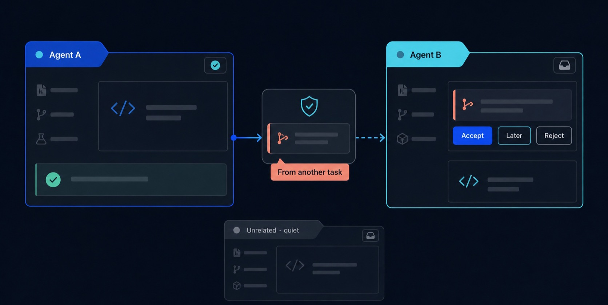

<h1 align="center">ThreadMesh</h1>

<p align="center">
  <strong>让彼此独立的 Agent session 产生有选择、有边界的主动协作。</strong>
</p>

<p align="center">
  Agent A 发现 Agent B 正好需要自己的结果，并在用户充当消息中转站之前主动联系它。
</p>

<p align="center">
  <a href="https://github.com/fyaic/threadmesh/actions/workflows/ci.yml"></a>
  <a href="LICENSE"></a>
  <a href="package.json"></a>
  <a href="docs/10-planning/project-status.md"></a>
</p>

<p align="center">
  <a href="#快速开始"><strong>快速开始</strong></a> ·
  <a href="docs/06-guides/real-world-cases.md">真实案例</a> ·
  <a href="docs/00-overview/harness-support.md">Harness 支持</a> ·
  <a href="docs/zh-CN/README.md">中文文档</a> ·
  <a href="README.md">English</a>
</p>

<p align="center">
  <a href="docs/06-guides/real-world-cases.md">
    
  </a>
</p>

<p align="center">
  <sub><strong>A 决定何时主动联系。</strong>B 决定是否接纳。无关任务保持安静。</sub>
</p>

ThreadMesh 是一个面向 Agent harness 的可移植协调层。它让一个 session 能在授权
范围内发现相关工作，并向另一个 session 建议上下文；接收方仍然决定是否以及何时
把这些上下文加入自己的模型历史。

它不是共享记忆、工作流引擎，也不允许一个 Agent 接管另一个任务。

> [!WARNING]
> ThreadMesh 目前是 pre-alpha，主动能力默认关闭。仅适合本地可信进程实验，不能
> 作为生产授权、多租户隔离或恶意 peer prompt 的安全边界。

## 为什么需要 ThreadMesh

多个 Agent 并行工作时，用户仍然需要人工协调每一次交接。

| 没有 ThreadMesh | 使用 ThreadMesh |
|---|---|
| 用户发现 A 的结果正好是 B 缺少的输入 | A 发现 B 声明的相关依赖 |
| 用户复制结果、找到 B、重新解释上下文 | A 发送一次有类型、有时效的建议 |
| 用户猜测是否应该打断 B | B 在 checkpoint 接受、延迟或拒绝 |
| 无关 session 很容易被误触 | 无关 session 保持静默 |

这里的“智能”是：工作变得相关时主动开口，不相关时保持安静。ThreadMesh 为这个
判断提供 policy、来源、mailbox、接收方同意和审计边界。

## 快速开始

不消耗模型额度，也不接触现有 Agent session，直接运行确定性闭环演示：

```sh
npx --yes --package=github:fyaic/threadmesh threadmesh demo
```

也可以从源码运行：

```sh
git clone https://github.com/fyaic/threadmesh.git
cd threadmesh
npm ci
npm run demo
```

演示覆盖“实现 → 评审 → 修复 → 验证 → 下游任务”，包括接收方 checkpoint、
无关路由抑制、验证后依赖解锁、重启恢复和精确清理。

[演示指南](docs/06-guides/attention-router-demo.md) ·
[人工对照](docs/06-guides/manual-relay-baseline.md) ·
[真实 Agent 案例](docs/06-guides/real-world-cases.md)

## 接入自己的 harness

SDK 目前处于 pre-alpha，从 GitHub 安装：

```sh
npm install github:fyaic/threadmesh
```

为每个模型 turn 提供受预算约束的发现与建议 bridge：

```js
import {
  createProactiveToolBridge,
  createThreadMeshClient,
} from "@fyaic/threadmesh";

const client = createThreadMeshClient({
  authorization: `Bearer ${process.env.THREADMESH_TOKEN}`,
  send: authenticatedJsonRpc,
});

const bridge = createProactiveToolBridge({
  client,
  source: currentTask,
  relationships: [{ relationshipId, target: relatedTask }],
});

await harness.runModelTurn({
  tools: bridge.tools,
  onToolCall: bridge.handleToolCall,
});
```

关系集合由 host 而不是模型决定。模型必须先发现才能发送，transport 调用前会保留
预算，接收方始终掌握 context admission。

[30 分钟接入指南](docs/06-guides/implement-an-adapter.md) ·
[完整 sender/receiver 示例](examples/proactive-tool-bridge.mjs)

## 已验证的主动性

公开验证明确区分相关、无关和 control 条件。

| 条件 | Agent A 的选择 | 对 B 的影响 |
|---|---|---|
| 存在相关依赖 | 发现一次 → 建议一次 | B 接受并完成 |
| 任务无关 | 发现一次 → 保持安静 | B 没有被激活 |
| 没有相关任务 | 不调用 ThreadMesh | 零干扰 |

当前真实模型案例包括：

- **Pi `0.84.2` → Kimi Code `0.38.0`：**相关时联系、无关时安静、上下文
  admission 和精确清理；
- **Codex CLI `0.145.0` → Kimi Code `0.38.0`：**跨产品自主选择
  `discover → suggest`；
- **Codex 生命周期链：**一次 kickoff 推动实现、评审、修复、验证和下游角色，
  无关 session 为零 turn；完整生产证据门仍未关闭。

[真实案例总览](docs/06-guides/real-world-cases.md) ·
[Pi 验证记录](docs/09-reviews/2026-08-25-pi-integration-kit-validation.md) ·
[Codex-to-Kimi 记录](docs/09-reviews/2026-08-25-codex-to-kimi-proactive.md)

## 能力

| 能力 | 当前实现 |
|---|---|
| 关系范围发现 | 只读取 host 授权关系中的最小任务摘要 |
| 有预算的主动建议 | 两个模型工具，每 turn 限制发现和发送次数 |
| 接收方主权 | mailbox checkpoint，明确接受、延迟或拒绝 |
| 时效与防重放 | 精确任务实例、过期、revision、幂等和 claim 检查 |
| 来源与审计 | sender、关系、理由、处置、admission 和清理记录 |
| Harness 可移植性 | transport-neutral SDK 与 App Server、ACP、subprocess adapter |
| 失败关闭 | 不把不支持的控制操作冒充成成功 |

真实产品实验目前只启用有边界的 `suggest`。`steer` 和 `interrupt` 仍然需要更严格
的权限门。

## Harness 支持

| Harness / 接入方式 | 已验证角色 | 证据 |
|---|---|---|
| Pi `0.84.2` extension | 通过公开 SDK 主动发送 | 真实模型通过 |
| Codex CLI `0.145.0` App Server | 主动 sender 与 receiver | 真实模型通过 |
| Kimi Code `0.38.0` ACP | 持久接收 session | 真实模型通过 |
| Gemini CLI `0.56.0` headless | subprocess receiver adapter | 确定性预检；真实模型待运行 |
| 自研 JavaScript harness | cooperative loop 与 native tool bridge | consumer 与 conformance 通过 |
| 通用 ACP Agent | 持久 session receiver | conformance 通过；Kimi 是真实 ACP 证明 |

其他 harness 只有在发布版本范围、capability 文档、conformance 结果和已知缺口后，
才会被标记为已验证集成。

[完整兼容矩阵](docs/00-overview/harness-support.md) ·
[Adapter contract](docs/05-adapters/adapter-contract.md)

## 安全边界

每个任务拥有自己的目标和模型可见历史。

- 不搜索全局 session，不共享完整 transcript；
- 精确、有方向、最小权限的关系授权；
- peer 内容先进入 mailbox，再由 receiver 判断；
- consequential request 必须检查时效和目标版本；
- 保留 peer 来源，不伪装成用户指令；
- capability 不满足时失败关闭，保留完整因果审计。

当前 adapter 不提供 OS sandbox。不要用它处理任意恶意 peer 内容或充当生产安全
边界。

[上下文主权](docs/01-concepts/context-sovereignty.md) ·
[权限模型](docs/04-safety/permission-model.md) ·
[威胁模型](docs/04-safety/threat-model.md) ·
[安全策略](SECURITY.md)

## 项目状态

- **协议：**可执行 `0.0-draft`；
- **Package：**`@fyaic/threadmesh@0.1.0-alpha.0`，可从 GitHub 安装；
- **Runtime：**面向本地可信进程的 authenticated JSON-RPC + SQLite coordinator；
- **验证：**388 项测试、55 个 schema case、7 个状态转换 case 和文档检查；
- **默认：**主动协调保持显式 opt-in；
- **主线：**先关闭真实产品实测基线和外部用户上手门，再扩展协议或 harness 范围。

[当前状态](docs/10-planning/project-status.md) ·
[路线图](ROADMAP.md) ·
[验证索引](docs/09-reviews/README.md)

## 文档

| 目标 | 从这里开始 |
|---|---|
| 理解产品 | [产品说明](docs/00-overview/product-guide.md) |
| 查看真实主动行为 | [真实 Agent 案例](docs/06-guides/real-world-cases.md) |
| 运行本地证明 | [Attention-router 演示](docs/06-guides/attention-router-demo.md) |
| 对比人工转发 | [人工基线](docs/06-guides/manual-relay-baseline.md) |
| 接入 harness | [Adapter 指南](docs/06-guides/implement-an-adapter.md) |
| 评估安全边界 | [威胁模型](docs/04-safety/threat-model.md) |
| 参与贡献 | [贡献指南](CONTRIBUTING.md) |

## 非目标

ThreadMesh 不是聊天系统、模型网关、工作流 DAG 引擎、全局 Agent 目录，也不允许
一个 Agent 控制无关任务。它不会取代 MCP 或 A2A。

## 社区

[Discussions](https://github.com/fyaic/threadmesh/discussions) ·
[Issues](https://github.com/fyaic/threadmesh/issues) ·
[贡献指南](CONTRIBUTING.md) ·
[治理](GOVERNANCE.md) ·
[支持](SUPPORT.md) ·
[行为准则](CODE_OF_CONDUCT.md)

## 许可证

ThreadMesh 采用 [Apache License 2.0](LICENSE)。
