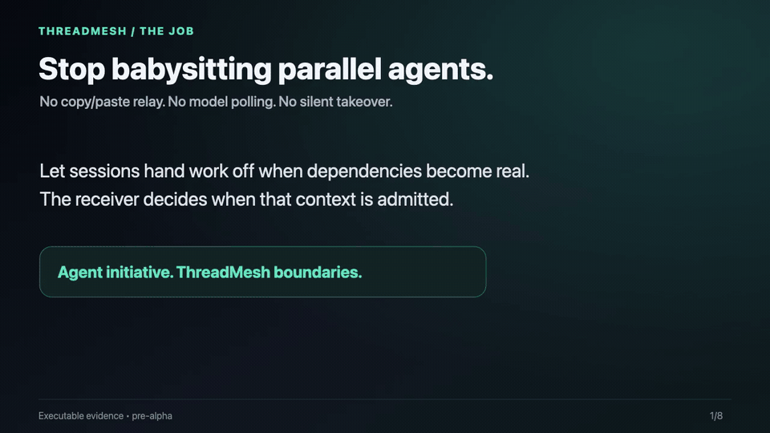

<p align="center">
  
</p>

<p align="center">
  <a href="https://github.com/fyaic/threadmesh/actions/workflows/ci.yml"></a>
  <a href="LICENSE"></a>
  <a href="package.json"></a>
  <a href="docs/10-planning/project-status.md"></a>
</p>

<p align="center">
  <a href="#快速开始"><strong>快速开始</strong></a> ·
  <a href="docs/06-guides/real-world-cases.md">真实案例</a> ·
  <a href="docs/00-overview/harness-support.md">Harness 支持</a> ·
  <a href="docs/zh-CN/README.md">中文文档</a> ·
  <a href="README.md">English</a>
</p>

# ThreadMesh

**不用再人工盯守多个并行 coding agent。**

ThreadMesh 会把完成、阻塞、评审发现和经过验证的依赖状态，在安全 checkpoint
路由给正确的 agent session：用户不用复制结果，不用消耗模型 turn 反复查询，也
不会让一个 session 静默接管另一个 session 的当前工作。

**Agent 提供主动性，ThreadMesh 提供边界。**

> [!IMPORTANT]
> ThreadMesh 目前是 pre-alpha，主动能力默认关闭。现阶段适合本地、可信进程范围
> 的实验，不应作为生产级授权、多租户隔离或处理恶意 peer prompt 的安全边界。

## 76 秒证据演示

<p align="center">
  <a href="docs/assets/demo/threadmesh-proof-walkthrough.mp4">
    
  </a>
</p>

这个演示由一次新鲜的可执行 demo 和已经保留的真实 Codex 证据生成，不冒充实时
录屏。对于同一个四次交接工作流，人工路径的最低成本是 1 次启动、4 次状态查询、
4 次复制转发，共至少 9 次用户操作；ThreadMesh 路径是 1 次启动，后续 0 次转发、
0 次轮询。耗时和 token 尚未实测，必须等网络正常的真实基线，文档不会虚构数字。

演示还覆盖最重要的安全负例：B 正在运行时，完成事件只会以
`checkpoint-offer` 留在 mailbox，decision 保持 `pending`；B 仍是 `running`，
不会触发 steer、interrupt 或新的 native turn。

[观看 MP4](docs/assets/demo/threadmesh-proof-walkthrough.mp4) ·
[查看演示资产证据边界](docs/assets/demo/README.md) ·
[亲自运行](docs/06-guides/attention-router-demo.md)

## 为什么需要它

当多个 Agent 并行工作时，用户往往被迫承担三份额外工作：

- 当“剪贴板”：发现 A 的结果正好是 B 缺少的输入，再复制、查找、解释；
- 当“轮询器”：不断询问评审、验证或依赖是否完成，即使状态没变化也消耗额度；
- 当“交通警察”：在不了解 B 当前工作的情况下决定排队、唤醒、转向还是打断。

ThreadMesh 把这个过程抽象成一项可移植能力：

1. host 为精确的任务实例建立有方向的授权关系；
2. B 只发布关系范围内的最小摘要，而不是完整私有历史；
3. A 查看摘要后，**自主判断**这次是否值得联系；
4. A 最多发送一条带来源、理由和时效的 `suggest`；
5. B 的 harness 在 checkpoint 接受、拒绝或延迟，再决定是否进入模型上下文；
6. 完整的决策、投递与清理链路可审计。

这里的“智能”不只是 Agent 会发消息。传输能力正在被 harness 原生 API、ACP 和
A2A 普及；ThreadMesh 关注的是**有选择的主动性**：依赖确实存在时主动联系，
无关时保持安静，验证后才解锁下游，并尊重接收 session 的自主权。

## 已验证的主动性效果

真实 Pi 行为验证只给 Agent A 两个有预算的 ThreadMesh 工具，并比较三种条件：

| 条件 | Agent A 的自主选择 | 对 B 的影响 |
|---|---|---|
| 存在相关依赖 | 发现一次 → 建议一次 | B 接受并完成 |
| 任务无关 | 发现一次 → 不发送 | B 没有被激活 |
| 无相关任务（control） | 不调用 ThreadMesh | 零干扰 |

同一个 relevant 路径随后完成真实跨产品闭环：**Pi `0.84.2` → ThreadMesh →
Kimi Code `0.38.0`**。Pi 主动选择联系 B，Kimi 保留自己的持久 session 和接收
边界，coordinator 记录 `context-admitted`，所有临时资源最终清理完成。另一组真实
**Codex CLI `0.145.0` → Kimi Code `0.38.0`** 案例也出现了相同的
`发现 → 建议` 自主工具序列。

[查看真实案例总览](docs/06-guides/real-world-cases.md) ·
[复现 Pi→Kimi 案例](docs/06-guides/pi-to-kimi-demo.md) ·
[查看有边界的验证记录](docs/09-reviews/2026-08-25-pi-integration-kit-validation.md)

## 快速开始

### 1. 运行闭环 attention-router 演示

```sh
npx --yes --package=github:fyaic/threadmesh threadmesh demo
```

也可以从源码运行：

```sh
git clone https://github.com/fyaic/threadmesh.git
cd threadmesh
npm ci
npm run demo
```

这个确定性案例会创建四个工作流 session，加一个隔离的活跃接收方安全任务，并执行
“实现 → 评审 → 修复 → 再评审 → 解锁下游任务”的完整链路。输出会分别展示事件、
路由理由、接收方决定、fixture 签名的验证 disposition、依赖效果与清理状态；它不
消耗模型额度，也不触碰你的真实 Agent session。

[查看 attention-router 演示指南](docs/06-guides/attention-router-demo.md)

再运行早期的 control/relevant/irrelevant 模型选择对照：

```sh
npm run validate:behavior:fake
```

再运行最小跨 harness 证明：

```sh
npm run validate:cross-harness:fake
```

### 2. 接入自己的 harness

SDK 尚未发布到 npm registry，请直接从 GitHub 安装 pre-alpha 版本：

```sh
npm install github:fyaic/threadmesh
```

把 SDK 连接到已认证的 ThreadMesh JSON-RPC transport，并为每个模型 turn 创建一
个主动工具 bridge：

```js
import {
  createProactiveToolBridge,
  createThreadMeshClient,
} from "@fyaic/threadmesh";

const client = createThreadMeshClient({
  authorization: `Bearer ${process.env.THREADMESH_TOKEN}`,
  send: async (request, { authorization }) => {
    const response = await fetch(process.env.THREADMESH_URL, {
      method: "POST",
      headers: { authorization, "content-type": "application/json" },
      body: JSON.stringify(request),
    });
    return response.json();
  },
});

const bridge = createProactiveToolBridge({
  client,
  source: currentTask,
  relationships: [{ relationshipId, target: relatedTask }],
});

await harness.runModelTurn({
  tools: bridge.tools,
  onToolCall: bridge.handleToolCall,
});
```

关系集合由 host 而不是模型决定。模型必须先发现才能发送；默认每个 turn 只允许
一次查询和一次建议；接收方 harness 仍然掌握 context admission。

[30 分钟接入指南](docs/06-guides/implement-an-adapter.md) ·
[完整 sender/receiver 示例](examples/proactive-tool-bridge.mjs)

## 有什么能力

| 能力 | 当前实现 |
|---|---|
| 关系范围发现 | 只读取 host 授权关系中的最小任务摘要 |
| 有预算的主动建议 | 两个模型工具，每 turn 限制发现和发送次数 |
| 接收方主权 | mailbox checkpoint，明确接受、拒绝或延迟 |
| 时效与防重放 | 精确任务实例、过期、revision、幂等和 claim 检查 |
| 来源与审计 | 记录 sender、关系、理由、处置、admission 和清理证据 |
| Harness 可移植性 | transport-neutral SDK，以及 ACP/App Server/subprocess 实验 adapter |
| 失败关闭 | 不把不支持的 `steer`/`interrupt` 冒充成成功 |

协议草案区分 `notify`、`suggest`、`steer`、`interrupt` 四类意图；目前真实产品
实验只启用有边界的 `suggest`。

## 已接入与可接入的 Agent harness

| Harness / 接入方式 | 已验证角色 | 证据级别 |
|---|---|---|
| Pi `0.84.2` extension | 通过公开 SDK 主动发送 | 真实模型通过 |
| Codex CLI `0.145.0` App Server | 主动 sender 与 receiver | 真实模型通过 |
| Kimi Code `0.38.0` ACP | 持久接收 session | 真实模型通过 |
| Gemini CLI `0.56.0` headless | subprocess receiver adapter | 确定性 + 无模型预检；真实模型未运行 |
| 自研 JavaScript harness | cooperative loop / native tool bridge | 打包消费与 conformance 通过 |
| 通用 ACP Agent | 持久 session receiver | 确定性 conformance；Kimi 是真实 ACP 证明 |

Claude Code、LangGraph、CrewAI、OpenAI Agents SDK 等可以成为 adapter 目标，
但在公开版本范围、capability、conformance 和已知缺口前，项目不会声称已验证兼容。

[完整兼容矩阵](docs/00-overview/harness-support.md) ·
[实现 adapter](docs/06-guides/implement-an-adapter.md)

## 安全边界

ThreadMesh 的核心规则是：**每个任务拥有自己的目标和模型可见历史。**

- 不搜索全局 session，不共享完整 transcript；
- 精确、有方向、最小权限的关系授权；
- peer 内容先进入 mailbox，再由 receiver 判断；
- consequential request 必须检查时效、任务实例和目标版本；
- 保留 peer 来源与理由，不伪装成用户指令；
- capability 不满足时失败关闭，完整因果链可审计。

当前 adapter 仍通过普通 prompt surface 投递已接受的 peer context，也不提供 OS
sandbox。不要用它处理任意恶意 peer 内容或充当生产安全边界。

[上下文主权](docs/01-concepts/context-sovereignty.md) ·
[权限模型](docs/04-safety/permission-model.md) ·
[威胁模型](docs/04-safety/threat-model.md) ·
[安全策略](SECURITY.md)

## 项目状态

- 协议：可执行 `0.0-draft`，仍可能调整。
- 包：`@fyaic/threadmesh@0.1.0-alpha.0`，可从 GitHub 安装；根 export 是精简 SDK，CLI 与显式 runtime subpath 会安装 Ajv 和原生 `better-sqlite3`。
- 参考 runtime：authenticated JSON-RPC + SQLite coordinator，面向本地可信进程实验。
- 验证：384 项测试，加 55 个 schema case、7 个状态转换 case、文档检查；这些计数分别报告。
- 默认策略：除非 maintainer 明确选择有边界实验 profile，否则主动协调保持关闭。
- 当前边界：第六次真实 Codex event-pump 已在一次 kickoff 后通过 9 个 native turn 完成 A→R→同一个 A→V→dependent，后续 runner phase prompt/direct activation 为 0，无关 session turn 为 0，清理 5/5；该次运行的 Git/verifier effect 是模拟的。真实 Git worktree 与 child verifier 已由 #133 合入同一路径。2026-09-02 的进程级本地代理恢复了证书校验与 WebSocket 连接；新鲜 live 重跑到达真实 A 发布和 reviewer admitted turn，随后在 ambiguous context reconciliation 处保守失败，清理仍为 5/5。
- 下一主线：修复或明确该 reconciliation blocker 后保留一次真实 Codex real-effects 闭环，完成实测人工基线，并观察 3 位外部 operator 的 15 分钟上手过程。在这些产品证据前，继续冻结新 harness、transport 和泛化 protocol 扩展。

[当前状态](docs/10-planning/project-status.md) · [路线图](ROADMAP.md) ·
[协议草案](spec/README.md) · [验证记录](docs/09-reviews/README.md)

## 文档与社区

- [中文文档入口](docs/zh-CN/README.md)
- [英文文档总览](docs/README.md)
- [产品说明](docs/00-overview/product-guide.md)
- [76 秒演示](docs/assets/demo/threadmesh-proof-walkthrough.mp4)
- [真实 Agent 案例](docs/06-guides/real-world-cases.md)
- [人工转发与轮询基线](docs/06-guides/manual-relay-baseline.md)
- [活跃 session 不打断案例](docs/06-guides/non-interrupting-handoff.md)
- [15 分钟外部上手挑战](docs/06-guides/15-minute-operator-challenge.md)
- [贡献指南](CONTRIBUTING.md)
- [GitHub Discussions](https://github.com/fyaic/threadmesh/discussions)
- [GitHub Issues](https://github.com/fyaic/threadmesh/issues)

ThreadMesh 采用 [Apache License 2.0](LICENSE)。
