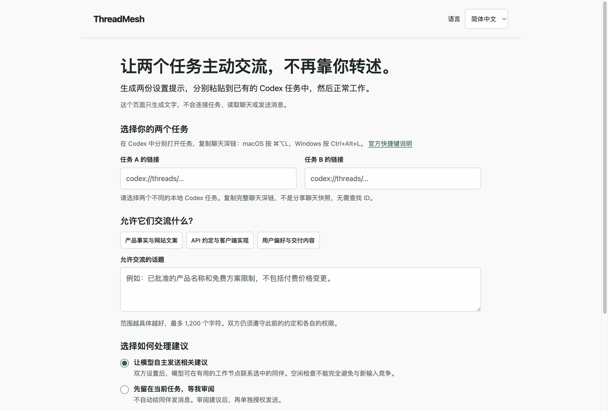

# Pairing helper and original-task API handoff

**Outcome:** the [no-install pairing helper](https://fyaic.github.io/threadmesh/)
is live. Its generated setup was used in the original two Codex validation
tasks. After an ordinary API change request, A chose to contact original B;
B updated its own client and tests while preserving earlier decisions.

This reduces template editing. It does **not** automatically connect tasks:
users still paste/send both setups and wait for confirmations. Codex supplies
native messaging and continuation; ThreadMesh supplies optional scoped guidance.

## Actual browser entry

This is an actual screenshot of the published helper with empty inputs, not a
native handoff screenshot or a staged conversation. The page accepts two copied
local chat links, a limited topic, advice mode and explicit consent. Three topic
presets cover product facts/copy, API/client changes and retained preferences.
It generates separate setup text and links back to the two original tasks.

The static page has no account, analytics, backend or browser storage. Chat
links/topics are not put into requests or URLs. Copying writes the selected
setup to the system clipboard, where normal operating-system behavior applies.
The public workflow is fetched later by the agent after the user sends setup.

Actual Chrome checks covered Chinese and English, desktop and 390 px mobile,
light/dark rendering, generation, successful clipboard write, changed-input
invalidation and a controlled clipboard-rejection fallback. A reviewer found
an asynchronous clipboard race; the fix locks copy/generation while a write is
pending and warns when changed inputs make the completed copy stale. Four app
tests exercise these states; ten generator tests cover links, consent, modes,
topic boundaries and generated text. The full suite passed: **475 tests,
474 passed, one optional native test skipped**, plus schema/transition checks.

The [implementation PR](https://github.com/fyaic/threadmesh/pull/174) was merged.
The [Pages deployment](https://github.com/fyaic/threadmesh/actions/runs/34184259676)
succeeded. Anonymous requests returned HTTP 200 with correct content types for
all four deployed files, byte-identical to the tested source. The public page
also loaded in Chrome with empty inputs and only same-origin static resources.
Native-app opening and keyboard copying of real chat links were not tested in
this browser check.

## Useful original-receiver outcome

The two existing, opted-in validation tasks first prepared local fixtures while
cross-task advice was stopped. A owned an API contract; B owned a client and
five tests. B already had these decisions: a 3000 ms timeout, correctly encoded
special-character cursors, no empty cursor query and `null` for no next page.

The manager dispatched the exact two strings returned by `buildPair(...)` into
the original tasks. Both read the pinned public workflow, resolved only their
selected peer and confirmed setup without peer sends or file changes. This
tests generated-prompt use, **not automatic browser submission or independent
manual GUI onboarding**.

After both confirmations, the only business request to A was:

> 双方设置已确认完成。API 的新版决定是：GET 路径改为 /v2/items，请求游标字段改为 cursor，响应下一页字段改为 next_cursor，列表字段仍为 items。请更新维护的 API 约定；不涉及鉴权或部署变化。

It did not name a recipient or instruct A to send. A updated its contract,
checked that B was idle and made one native send. Original B received the
source-attributed message and made its own native file changes:

| Contract | Before | B's updated client |
|---|---|---|
| GET path | `/v1/items` | `/v2/items` |
| Request cursor | `pageToken` | `cursor` |
| Response next page | `nextPageToken` | `next_cursor` |
| Existing timeout | 3000 ms | Preserved |
| Cursor/no-next-page behavior | Encode cursor; omit empty query; return `null` | Preserved |

B updated and passed its own five tests. Independent maintainer assertions
also checked the exact contract, special-character round trip, absence of an
empty query, and that the old response field is no longer consumed. The three
earlier product/copy/price artifacts were unchanged. The manager did not relay
the business change directly to B or edit B's files.

The business handoff took approximately **70 seconds**, from A's request to B's
completion. Setup was separate: approximately **31 seconds for A and 23 seconds
for B**, run in parallel. Both tasks then acknowledged stop, with no further
peer sends or edits in those stop turns. An independent internal subagent
reviewed original turn items and artifacts and accepted this bounded case.

## Evidence and limits

Owner-only private retention includes generated prompts and the selected
setup/business/stop native turn items recovered using the official read-only
App Server. Public records omit task IDs, local paths and unrelated history.
SHA-256 commitments:

- Generated prompts: `ff58002a0135d2e90f92ff20468926f5117cd5bacc4ace3a3265758489dde282`
- Final selected-turn capture: `44ebcd8606738b820e5c8bb7d4c0e283fac924edd056ea418adef37efd79f3f6`

B's retained fetch contains the full pinned workflow. A's web result retains
page metadata/summary and its reading confirmation, not the full web response.
The archive is a selected run window, not a complete lifetime task export.

This is a **local API adapter case**, not an HTTP-service integration test.
There is no recording of the native exchange. It does not establish reliability
across accounts, simultaneous typing safety, universal desktop support, quota
recovery, or an incremental advantage over native-only Codex. An idle check
does not make the following send atomic. Review-only mode drafts advice; it is
not permission to send. Agent guidance is not a hard host-enforced security
boundary. Neither this case nor the helper repacks the alpha.3 CLI release.

## Later correction: local tasks first, not a website demo

Following user feedback on September 8, the helper was demoted to an optional
setup-text utility. The bilingual README/guide now start in the original Codex
tasks. The webpage explicitly states that it neither runs agents nor shows live
progress and that closing the page does not stop collaboration. Its revised
Chinese heading and boundary text were inspected in actual Chrome. This is a
positioning correction, not a new integration or native demonstration.

The skill at `c0a0a913439732229a2bb811d23cc790c2dd0408` adds concise in-task
status guidance: local readiness is not peer readiness, idle is not configured,
sent is not done, unknown observations stay unknown, and read-only status must
not reactivate a stop. Both guide templates and the optional generator pin this
revision. Earlier successful cases above used the earlier pinned workflow;
their outcomes are not retroactive live validation of this revision.

An independent internal subagent performed a read-only behavioral review of
three cases: idle peer with unknown setup, accepted send with empty result, and
status after stop. It passed; the suggested explicit peer-confirmation condition
was incorporated into the send rule. This was a tabletop review, not a real
agent exchange or an independent user's onboarding. Skill validation, all 14
helper regression tests, the full 474-pass/one-skip suite and documentation lint
passed. The system Python lacked PyYAML; the validator passed in an isolated
`uv --with pyyaml` environment without changing project dependencies.

One read-only status request was also dispatched to the original, previously
stopped receiver using the new public workflow. **No live status pass is
claimed.** The desktop wait surface reported an active turn with no readable
result, while the official read-only App Server capture marked that selected
turn interrupted and retained only the incoming request. Neither proves a
completed check. There were no outgoing sends or file changes in the captured
items, and the four checked receiver files retained their pre-request hashes.
This is a bounded negative observation, not proof that no later activity can
occur. No retry or additional business request was dispatched. Its selected-turn
capture is retained privately with SHA-256
`b87454bfb173bb6c113c5d534efb7aad1bbcb9e8935ee028aeea54fefa901ead`.

Independent GUI first use, persistent desktop control, simultaneous-input
safety and measured native-only advantage remain open. The reordered
[roadmap](../../ROADMAP.md#active-priority--existing-desktop-clients-2026-09-08)
is the active acceptance plan; old completed pairing gates must not be restarted
as substitutes for these outcomes.
